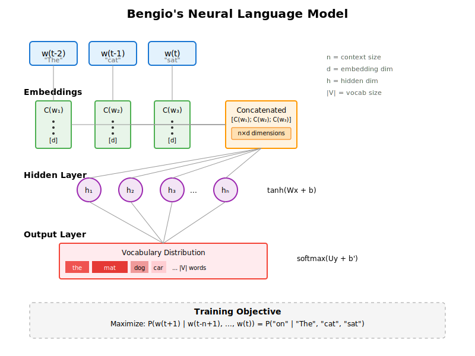

# Visualizations

This folder contains visual resources for the LLM4LLM course, including diagrams, charts, and interactive visualizations that help illustrate key concepts in language model architecture and training.

## Organization

Visualizations are organized by module and session to match the course structure:

```
visualizations/
├── module-1/           # Foundations of Word Prediction and Embeddings
│   ├── session-1.1/    # Understanding Next-Word Prediction
│   ├── session-1.2/    # Building Your First N-gram Predictor
│   ├── session-1.3/    # From N-grams to Neural Representations
│   ├── session-1.4/    # Neural Language Model Training
│   └── session-1.5/    # Advanced Word Embeddings and Applications
├── module-2/           # Transformer Architecture and Modern LLM Training
│   ├── session-2.0/    # Transformers as Generative Search Engines
│   ├── session-2.1/    # From Text to Transformer Inputs
│   ├── session-2.2/    # Attention and the Transformer Block
│   └── session-2.3/    # Training and Scaling Modern LLMs
└── module-3/           # (Future modules...)
```

## File Naming Conventions

To maintain consistency and clarity, please follow these naming conventions:

1. **Use descriptive, hyphenated names**: `bengio-neural-language-model.svg`
2. **Include the visualization type when relevant**: `attention-mechanism-diagram.svg`, `perplexity-comparison-chart.png`
3. **Number sequences if order matters**: `training-process-step-1.svg`, `training-process-step-2.svg`
4. **Use lowercase with hyphens**: Avoid spaces, underscores, or camelCase

## File Formats

- **`.svg`**: Preferred for diagrams and architectural visualizations (scalable, editable)
- **`.png`**: For charts, plots, or images with many colors/gradients
- **`.gif`**: For simple animations showing processes or transformations
- **`.html`**: For interactive visualizations (ensure they're self-contained)

## Content Guidelines

### What Makes a Good Visualization

1. **Clarity**: The main concept should be immediately apparent
2. **Consistency**: Use consistent colors, fonts, and styles across related diagrams
3. **Labels**: All components should be clearly labeled
4. **Context**: Include titles and brief captions where helpful
5. **Accessibility**: Use color schemes that work for colorblind users; include alt text descriptions

### Visual Style Guide

To maintain consistency across all visualizations:

#### Colors
- **Input layers**: Light blue (#E3F2FD, border: #1976D2)
- **Embeddings**: Light green (#E8F5E9, border: #4CAF50)
- **Hidden layers**: Light purple (#F3E5F5, border: #9C27B0)
- **Output layers**: Light red (#FFEBEE, border: #F44336)
- **Attention/Special**: Light orange (#FFF3E0, border: #FF9800)
- **Background**: White or light gray (#F5F5F5)
- **Text**: Dark gray (#333) for main text, medium gray (#666) for annotations

#### Typography
- **Titles**: 18-20px, bold
- **Section headers**: 14-16px, bold
- **Labels**: 12-14px, regular
- **Annotations**: 10-11px, regular or italic

#### Dimensions
- **Standard width**: 800px (for consistency in course materials)
- **Height**: Variable, but maintain reasonable aspect ratios
- **Padding**: Minimum 20px around content
- **Line weights**: 2px for major elements, 1px for connections

## How to Reference Visualizations

When referencing visualizations in course materials:

```markdown

```

Or for documents that include them inline:
```markdown
See the [neural language model architecture diagram](../visualizations/module-1/session-1.3/bengio-neural-language-model.svg) for a visual representation.
```

## Contributing New Visualizations

When adding new visualizations:

1. Place the file in the appropriate module/session folder
2. Follow the naming conventions above
3. Include source files if applicable (e.g., `.ai`, `.sketch`, `.drawio`)
4. Add a brief description to this README if it's a major diagram
5. Ensure the visualization is referenced in the corresponding session content

## Major Visualizations Index

### Module 1: Foundations

- `bengio-neural-language-model.svg` - Architecture diagram showing input words, embeddings, concatenation, hidden layer, and output distribution
- `n-gram-vs-neural-comparison.svg` - Side-by-side comparison of n-gram and neural approaches
- `word-embedding-space.svg` - 2D/3D visualization of word vectors and their relationships
- `gradient-descent-landscape.svg` - Illustration of optimization in loss landscape

### Module 2: Transformers

- `transformer-block-architecture.svg` - Complete transformer block with attention, FFN, and residual connections
- `attention-mechanism-flow.svg` - Query-Key-Value computation and attention weights
- `multi-head-attention-perspectives.svg` - How different heads capture different relationships
- `position-embeddings-sinusoidal.svg` - Visualization of sinusoidal position encodings

### Module 3: Advanced Topics

*(To be added as module content is developed)*

## Tools and Resources

Recommended tools for creating visualizations:

- **Diagrams**: draw.io, Figma, Adobe Illustrator, Inkscape
- **Charts/Plots**: Python (matplotlib, seaborn), D3.js, Plotly
- **Animations**: After Effects, CSS/JS animations, Manim
- **Interactive**: Observable, D3.js, p5.js

## License

All visualizations in this folder are part of the LLM4LLM course materials and follow the same license as the main repository.
